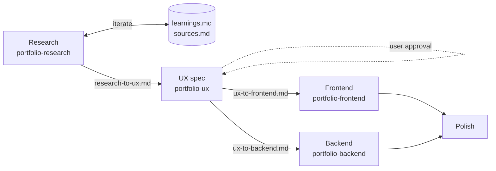

# Portfolio agent orchestration

Multi-agent workflow for evolving this portfolio without lane bleed. Skills live in `.cursor/skills/`; handoff artifacts in `docs/handoffs/`.

## Principles

- **SOUL.md**: All agents read [SOUL.md](../SOUL.md) for Kyle’s voice, constraints, and site goals.
- **Staff++ positioning**: Show senior judgment and real scope — no invented projects or hype copy.
- **Design before build**: UX spec and user approval before FE/BE implementation of new surfaces.
- **Parallel implementation**: Frontend (`ui/`) and backend (`server/`) run against the same UX version after the gate.

## Agent roles

| Agent | Skill | Owns |
|-------|-------|------|
| Research | `portfolio-research` | Trends, references, Design Brief → `research-to-ux.md`; persists to `docs/research/learnings.md` |
| UX | `portfolio-ux` | IA, copy, tokens, motion, acceptance criteria → `ux-spec.md`, lane handoffs |
| Frontend | `portfolio-frontend` | React UI under `ui/src/` |
| Backend | `portfolio-backend` | Express API under `server/src/` |
| Orchestrator | `portfolio-orchestrator` | Sequencing, merges, user checkpoints (optional) |

Repo entry point for Cursor: [AGENTS.md](../AGENTS.md).

## Pipeline



### Research feedback loop

Each research run:

1. Read `SOUL.md` + `docs/research/learnings.md`.
2. Plan queries → search/browse → score references (Staff++ rubric in research skill).
3. Update `docs/handoffs/research-to-ux.md` (cite learnings version).
4. **Append** run log in `learnings.md`; refine `sources.md` when a URL earns reuse.

See [docs/research/README.md](research/README.md).

### Default sequence

1. **Research** (optional): Fill `docs/handoffs/research-to-ux.md`.
2. **UX**: Fill `ux-spec.md`, `ux-to-frontend.md`, `ux-to-backend.md`; get user approval on copy/IA.
3. **Implement**: Run FE and BE in parallel (separate chats or Task subagents).
4. **Polish**: FE + UX criteria, or orchestrator pass for consistency.

Skip research for small tweaks if UX can spec directly from the codebase.

## How to invoke in Cursor

Skills use `disable-model-invocation: true` — **name the skill** in your prompt:

```
Use portfolio-research skill: benchmark Staff engineer portfolios for home hero patterns.
```

```
Use portfolio-ux skill: Draft ux-spec for work section using research-to-ux.md.
```

```
Use portfolio-frontend skill: Implement ux-to-frontend.md for Home package.
```

```
Use portfolio-backend skill: Implement analytics changes in ux-to-backend.md.
```

```
Use portfolio-orchestrator skill: Plan the next pipeline run for contact flow improvements.
```

Project rule `.cursor/rules/portfolio-agents.mdc` applies when you touch `ui/`, `server/`, or `docs/`.

## Handoff checklist

Before **frontend** or **backend** code on net-new UX:

- [ ] `docs/handoffs/ux-spec.md` has acceptance criteria
- [ ] User approved positioning / hero / work framing (if changed)
- [ ] `ux-to-frontend.md` lists packages under `ui/src/packages/`
- [ ] `ux-to-backend.md` filled or explicitly N/A
- [ ] Same version/date on all handoff files

Before **merge / ship**:

- [ ] Acceptance criteria checked
- [ ] Contact form still matches `validation.ts` field errors
- [ ] No fictional work added to `projectData.ts` or copy

## Cursor Task / subagents

Map one subagent per lane:

| Task prompt prefix | Attach |
|--------------------|--------|
| `portfolio-research` | Goal + any constraints |
| `portfolio-ux` | `research-to-ux.md` if exists |
| `portfolio-frontend` | `ux-to-frontend.md`, `ux-spec.md` |
| `portfolio-backend` | `ux-to-backend.md`, `ux-spec.md` |
| `portfolio-orchestrator` | Goal + links to current handoffs |

Parent agent (or you) merges outputs and resolves conflicts per orchestrator skill.

## Repo paths (quick reference)

- **UI**: `ui/src/packages/{app,home,work,contact,common,api-service,layout}/`
- **Server**: `server/src/{routes,middleware,services,utils}/`
- **Handoffs**: `docs/handoffs/*.md`
- **Research memory**: `docs/research/learnings.md`, `docs/research/sources.md`
- **Agent baseline**: `SOUL.md`
